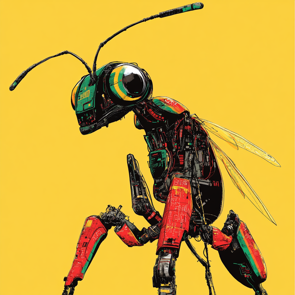

# GitHub Dagger Agents

Overview

This Github repo is a mono repository that contains an accumulation of agentic Github bots. The bots are designed with the intent of automating tasks and helping with streamlining of processes in a Github environment. Utilizing the power of automation, these bots search to augment cooperation, enhance effectiveness, and guarantee consistency across different repositories.

## Arachnid

## Agents

### If you want to know learn more about the coverage agent, please visit [here](agents/coverage_agent/README.md)
