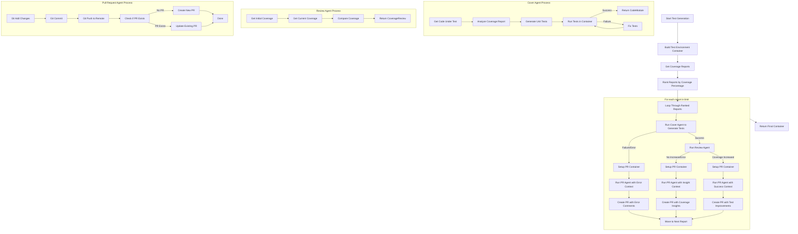

# GitHub Dagger Agents

```mermaid
flowchart TD
    start[Start Test Generation] --> build[Build Test Environment Container]
    build --> getCoverage[Get Coverage Reports]
    getCoverage --> rankReports[Rank Reports by Coverage Percentage]
    rankReports --> loopReports[Loop Through Ranked Reports]
    
    subgraph ProcessLoop["For each report in limit"]
        loopReports --> runCoverAgent[Run Cover Agent to Generate Tests]
        
        runCoverAgent -- Success --> runReviewAgent[Run Review Agent]
        runCoverAgent -- Failure/Error --> setupFailurePR[Setup PR Container]
        
        setupFailurePR --> runPRAgent1[Run PR Agent with Error Context]
        runPRAgent1 --> createFailurePR[Create PR with Error Comments]
        createFailurePR --> nextReport[Move to Next Report]
        
        runReviewAgent -- Coverage Increased --> setupSuccessPR[Setup PR Container]
        runReviewAgent -- No Increase/Error --> setupInsightPR[Setup PR Container]
        
        setupInsightPR --> runPRAgent2[Run PR Agent with Insight Context]
        runPRAgent2 --> createInsightPR[Create PR with Coverage Insights]
        createInsightPR --> nextReport
        
        setupSuccessPR --> runPRAgent3[Run PR Agent with Success Context]
        runPRAgent3 --> createSuccessPR[Create PR with Test Improvements]
        createSuccessPR --> nextReport
    end
    
    ProcessLoop --> finish[Return Final Container]
    
    subgraph CoverAgentProcess["Cover Agent Process"]
        getCT[Get Code Under Test] --> analyzeCR[Analyze Coverage Report]
        analyzeCR --> genTests[Generate Unit Tests]
        genTests --> runTests[Run Tests in Container]
        runTests -- Success --> returnTests[Return CodeModule]
        runTests -- Failure --> fixTests[Fix Tests]
        fixTests --> runTests
    end
    
    subgraph ReviewAgentProcess["Review Agent Process"]
        getInitialCov[Get Initial Coverage] --> getCurrentCov[Get Current Coverage]
        getCurrentCov --> compare[Compare Coverage]
        compare --> returnResult[Return CoverageReview]
    end
    
    subgraph PRAgentProcess["Pull Request Agent Process"]
        gitAdd[Git Add Changes] --> gitCommit[Git Commit]
        gitCommit --> gitPush[Git Push to Remote]
        gitPush --> checkPR[Check if PR Exists]
        checkPR -- PR Exists --> updateExisting[Update Existing PR]
        checkPR -- No PR --> createNewPR[Create New PR]
        createNewPR --> done[Done]
        updateExisting --> done
    end

```
